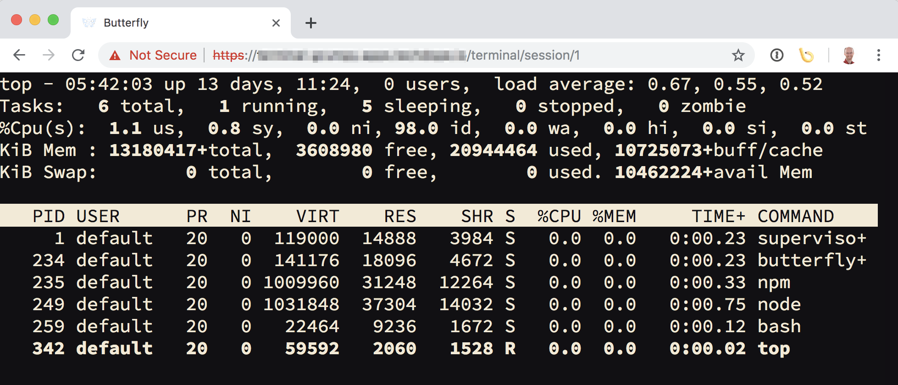

Workshop Terminal
=================

This repository contains software for deploying a containerised user environment in OpenShift, where users are provided access to the environment via a terminal in their web browser. It can be used to support workshops where users need access to command line clients and other tools when working with OpenShift, and you want to avoid needing to have users install anything on their own local computer.



Command line clients, tools and software stacks which are included are:

* Editors: ``vi``/``vim``, ``nano``.
* Kubernetes clients: ``kubectl``
* OpenShift clients: ``oc``, ``odo``.
* Language runtimes: ``java``, ``node.js``, ``python``, ``ruby``.

For the language runtimes, commonly used packaging tools for working with that language are also included.

Quick start instructions
------------------------

To quickly see what the terminal environment looks like, run:

```
oc new-app https://raw.githubusercontent.com/openshift-homeroom/workshop-terminal/master/templates/production.json
```

This will deploy an instance of the user environment as a standalone deployment. The name of the deployment will by default be ``terminal``.

To determine the hostname assigned to the route which you need to use in the URL to access the terminal, run:

```
oc get route/terminal
```

When you access the URL for the terminal, you will if necessary be redirected to the login page for the OpenShift cluster the terminal is deployed to. You should enter your login and password for the OpenShift cluster.

After you have supplied your credentials, you will be granted access to the terminal.

Note that you will only be granted access to the terminal if your are listed as a project admin for the project the terminal is deployed to. Users of the OpenShift cluster who are members of your project but who only have edit or view access, or users who are not a collaborator of your project, will not be granted access to the terminal.

When you use the ``oc`` and ``kubectl`` command line tools from the terminal, you will already be logged into the cluster as a special service account user. You should have the same rights as a project admin for that project. If you need the full access rights of your original OpenShift user, run ``oc login`` and login as your actual user.

To delete the deployment when done, run:

```
oc delete all,serviceaccount,rolebinding,configmap -l app=terminal
```

Creating multiple sessions
--------------------------

Whenever you access the root URL for the terminal deployment, you will be redirected to the same session each time. That is, to the sub URL path of ``/terminal/session/1``.

If you want to create multiple terminal sessions within the one user environment, create a new browser tab or window, enter in the same URL, but change ``1`` in the sub URL path to a different value. You can use any alphanumeric value for the session name, as well as dashes.

Note that although this will provide you with a separate terminal session, it is still running your shell in the same container as all other terminal sessions you create with the same terminal deployment. Seperate containers are not created.

This means you cannot use this mechanism as a means of providing access to multiple users. If you do and are using command line tools such as ``oc`` or ``kubectl``, the users will interfere with each other, as the terminal sessions share the same home directory.

If you need to provide terminal sessions to multiple users, each user should create their own deployment for the terminal, or you should use the separate multi user [terminal spawner](https://github.com/openshift-labs/workshop-spawner) application.

Creating a custom image
-----------------------

As the contents of the terminal image dictates what tools you have available in the user environment, you may want to customise the image contents to add additional tools. You may also want to add content such as application source code, configuration files etc, to be used by someone in a workshop.

There are two ways you can customise the contents of the image.

The first is that the image is Source-to-Image (S2I) enabled. The image can therefore be used as an S2I builder to add additional content. In this case, because an S2I build runs as a non ``root`` user, you will not be able to install additional system packages.

To create a custom image using S2I, run:

```
oc new-build --name myterminal quay.io/openshiftlabs/workshop-terminal:master~https://github.com/yourusername/yourrepo
```

Anything in the Git repository will be copied into the ``/opt/app-root/src`` directory of the image.

If you want to run your own steps during the build phase, after the files have been copied to the ``/opt/app-root/src`` directory, supply an executable shell script in the Git repository at the location ``.workshop/build``. Add to this script the extra build steps.

If you want to have special steps run when the terminal instance is being started, supply an executable shell script in the Git repository at the location ``.workshop/setup``. Add to this script the extra steps to be run each time the container is started.

The latter setup script can be used to modify files placed into the image based on the specific user environment. Note that the script is run each time the container is started, so any actions should take that into consideration.

Once you have your custom image built, the easiest way to switch to it for an existing terminal deployment is to run:

```
oc tag myterminal:latest terminal:latest
```

Alternatively, if you have uploaded the custom terminal image to an accessible image registry, you can create a fresh deployment using the template by running:

```
$ oc new-app https://raw.githubusercontent.com/openshift-homeroom/workshop-terminal/master/templates/production.json \
  --param APPLICATION_NAME=myterminal \
  --param TERMINAL_IMAGE=quay.io/yourusername/youimagename:latest
```

The alternative to using an S2I build, where you need to install additional system packages, is to use a ``Dockerfile`` build. In order to integrate properly with the terminal S2I builder mechanism for build and setup steps, it is recommended you use a ``Dockefile`` containing:

```
FROM quay.io/openshiftlabs/workshop-terminal:master

USER root

COPY . /tmp/src

RUN rm -rf /tmp/src/.git* && \
    chown -R 1001 /tmp/src && \
    chgrp -R 0 /tmp/src && \
    chmod -R g+w /tmp/src

USER 1001

RUN /usr/libexec/s2i/assemble
```

Add the additional steps which need to be run as ``root``, within the section where the ``USER`` is set to ``root``.

Note that if installing anything into ``/opt/app-root`` from the ``Dockefile``, ensure that ownership of the files is changed to ``1001:0`` and the ``fix-permissions`` script is run on the ``/opt/app-root`` directory. These steps ensure that a user can still properly work with and edit the files which were added as ``root``.

The resulting image created from the ``Dockerfile`` build would be used in the same way.

Using versioned images
----------------------

The URL for the template used above, is taken from the ``master`` branch of this Git repository. It is therefore bound to the most recent tagged version of the terminal image. Similarly, ``master`` was used as the tag when explaining custom builds.

As the GitFlow branching model is used, although ``master`` is only updated when a tag is made, if you want to be certain that what version you are using doesn't change, you should use a specific tag.

For the template, either make a copy of the template from ``master``, or go to GitHub, identify a specific tag, and use the URL to the template from that tag.

For the images when doing a custom build, you can find a specific tagged version by going to:

* https://quay.io/repository/openshiftlabs/workshop-terminal?tab=tags

Customising deployment
----------------------

The template used above is the recommended method for deploying the terminal. The template will do the following for you:

* Ensure that a secure HTTPS connection is used when accessing the terminal from your web browser.
* Enable authentication via the OpenShift cluster login page, with access to the terminal only granted to users who have ``admin`` role in the project.
* Create a service account under which the terminal container will run, where the service account has ``admin`` access to the project, and you will be automatically logged into the OpenShift cluster.
* Ensure that the ``Recreate`` deployment strategy is used so will only can have one terminal pod in existance when doing a restart.

If you need to customise the deployment, such as to add persistent storage, the preferred path is to copy the template and modify it to suit your requirements, preserving the features above.

If you choose not to use the template and deploy the terminal image directly, there will be no authentication protecting access to the terminal session. From the terminal session, you will also need to explicitly log into the OpenShift cluster you want to use using ``oc login``.

With knowledge that there is no authentication protecting access, you can deploy the terminal image directly by running:

```
oc new-app quay.io/openshiftlabs/workshop-terminal:master --name terminal
```

To create a secure HTTPS route for accessing the terminal use:

```
oc create route edge --service terminal --insecure-policy Redirect
```

If you want to use simple authentication using HTTP Basic authentication, rather than link it to the OpenShift cluster user authentication, run:

```
oc set env dc/terminal AUTH_USERNAME=grumpy AUTH_PASSWORD=secret
```

or set the environment variables when using ``oc new-app`` to deploy the image.

For authentication using the OpenShift cluster login page, refer to the template, as it requires additional resources to be created in order to work.
